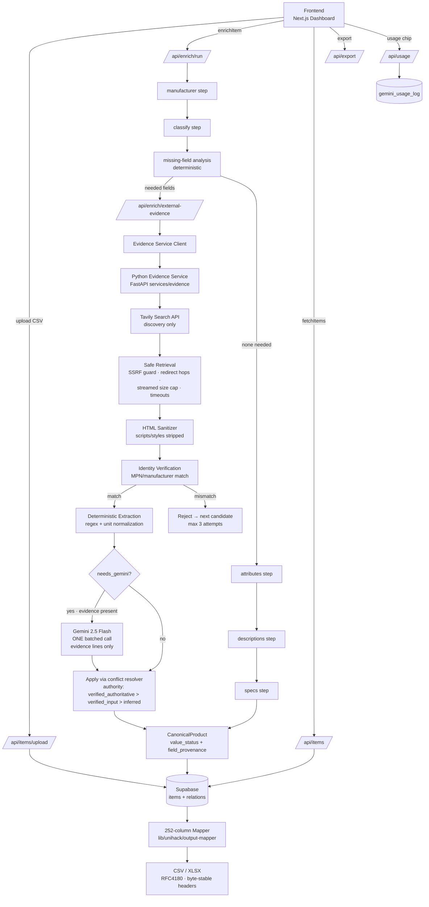

# InduIntel — Production Architecture

## End-to-end flow



## Layer responsibilities

| Layer | Location | Notes |
|---|---|---|
| Frontend | `app/dashboard/**`, `app/page.tsx` | Reads backend status/confidence; usage chip from `/api/usage`; no mock data |
| Next.js API | `app/api/**` | Thin routes; auth token on writes; quota in batch route |
| Pipeline orchestrator (batch/offline) | `lib/pipeline/orchestrator.ts` | Identity→dedupe→missing-fields→evidence→conflicts→Gemini gate; bounded concurrency |
| Product intelligence | `lib/product-intelligence/*` | types, canonical, normalize, identity, conflicts, missing-fields, category-attributes |
| Input normalization | `lib/input/input-normalizer.ts` | Alias resolution, RFC4180 parse, conflict preservation |
| Evidence client | `lib/evidence/client.ts` | Timeout-bounded HTTP to Python service |
| Python evidence service | `services/evidence/*` | search (Tavily) → fetch → sanitize → identity → extract |
| Export | `lib/unihack/output-*`, `app/api/export` | Frozen 252-header contract |

## Where provenance & value status live

- `CanonicalProduct.value_status[field]`: `verified | inferred | unresolved | conflicting | invalid`
- `CanonicalProduct.field_provenance[field]`: `{source_type, source_url, source_title, evidence, confidence, retrieved_at}`
- Persisted through the enrichment tables; export mapper reads values only —
  statuses remain queryable for audits (`reports/data-quality-audit.json`).

## Authority priority (conflict resolution)

```
verified_authoritative (identity-matched external)
  > verified_input (organizer data)
  > inferred (Gemini from evidence)
```

Conflicts keep ALL candidate values and mark the field `conflicting`.
